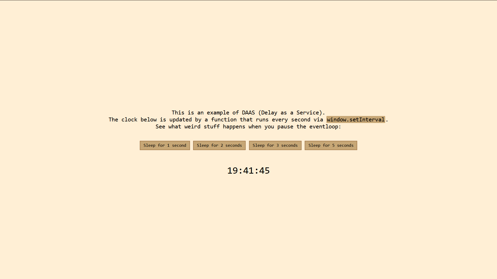

# Delay as a Service

*You heard it here first, folks*

The way this works is by sending a synchronous `XMLHttpRequest` to a server that
you run. The client specifies how long the server should wait to respond in the
query string.
This does, of course, require a server of some sorts.
Theoretically, the server could be implemented using a service worker so
that latency is no longer an issue. I'll leave that up to someone else to do.

[Run the example: ](example)
